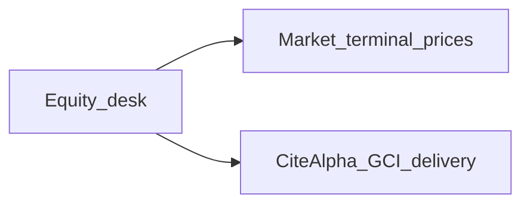
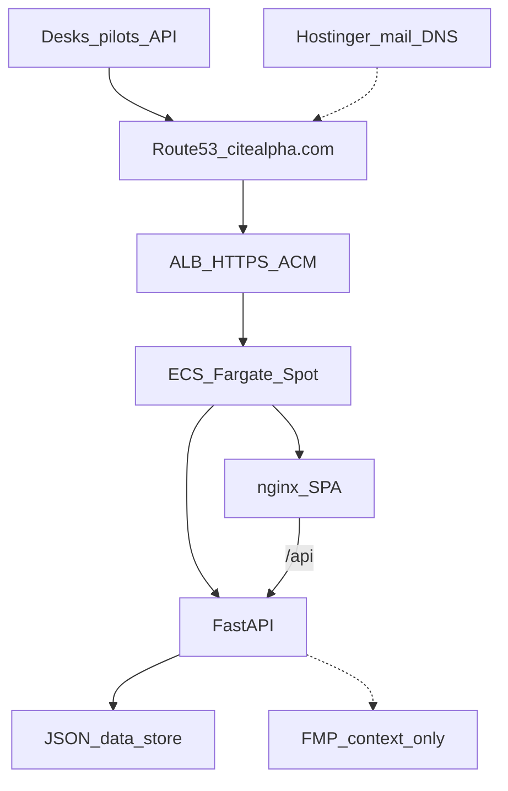
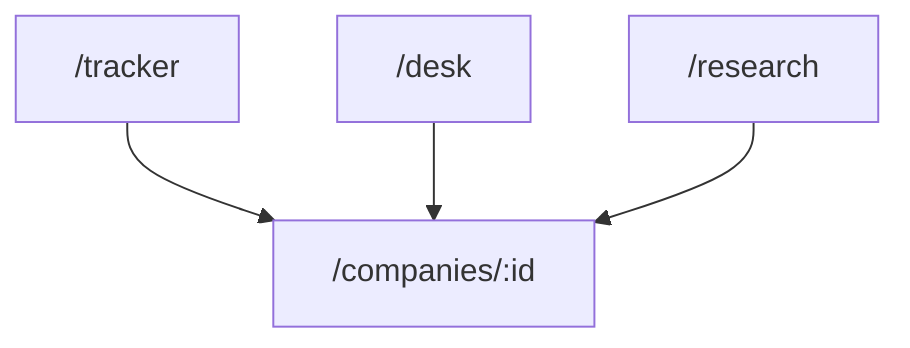
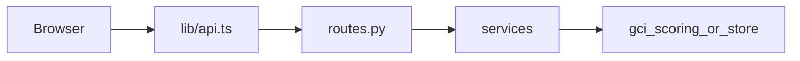
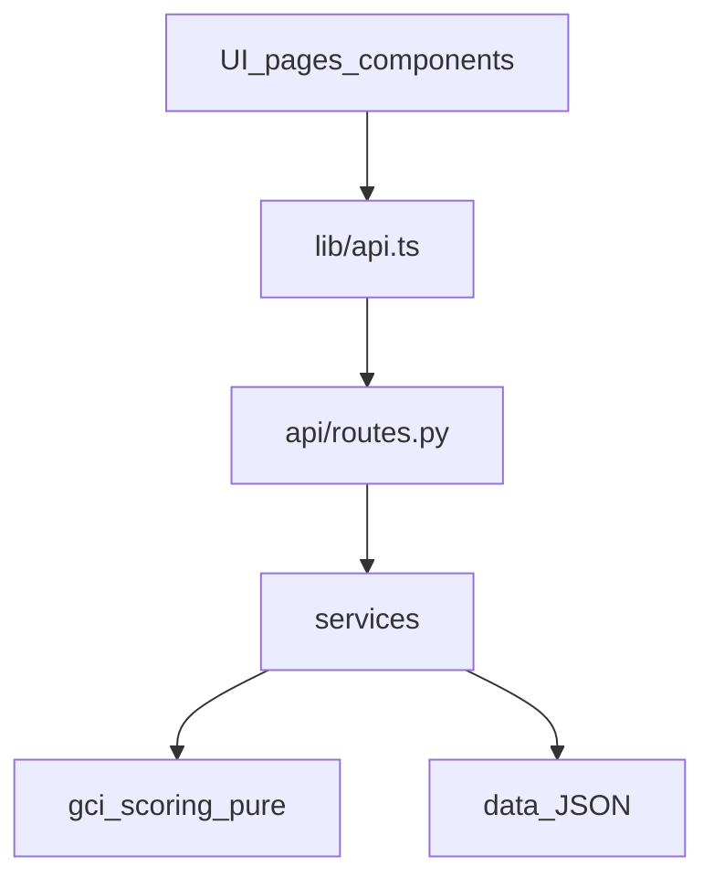
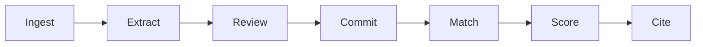
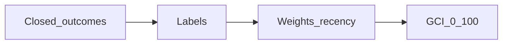
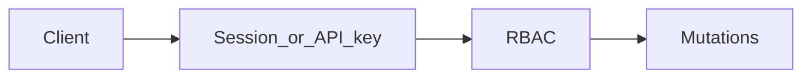
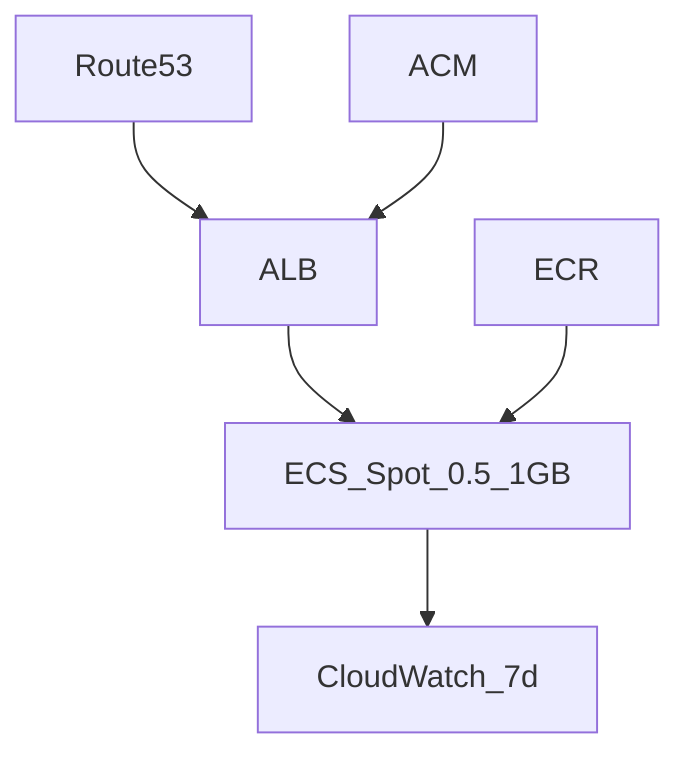

# CiteAlpha — Architecture & Design

**Product:** CiteAlpha · **Entity:** Ocotillo Innovation Private Limited  
**Visibility:** internal doc only — not published on citealpha.com  
**Kb summary:** [`docs/kb/02-architecture.md`](kb/02-architecture.md)

Detailed design reference with diagrams. Prefer this over chat folklore when changing stack boundaries.

---

## 1. Product wedge



| In scope | Out of scope |
|---|---|
| Guidance ↔ subsequent actual + evidence trail | Sentiment as the product |
| India Sensex → Nifty | US-first rebuild |
| HITL extract review | Invented actuals |
| Factual GCI 0–100 | Retail Buy / Hold / Sell |

---

## 2. System context



---

## 3. Product surfaces



---

## 4. Request path



---

## 5. Application layers



| Layer | May | Must not |
|---|---|---|
| `gci_scoring.py` | Pure math | DB, HTTP, wall-clock |
| `repository.py` | I/O store | Scoring policy |
| `routes.py` | Auth, validation | Business formulas |
| `lib/api.ts` | Typed fetch | Ad-hoc fetch elsewhere |

---

## 6. Guidance pipeline



Pending until Accept. Match key: `(company_id, period, metric)`.  
IR crawl never auto-scores into GCI. See [`04-pipeline.md`](kb/04-pipeline.md).

---

## 7. Scoring



Default **v3**. Labels: met / exceeded / missed / dropped; pending & unmapped excluded.  
Audits: withdrawal −15, definition shift −10. Detail: [`03-scoring.md`](kb/03-scoring.md).

---

## 8. Auth



Demo: `X-API-Key: intellens-demo`. Optional OIDC.

---

## 9. AWS



No NAT. Idle: `scripts/aws-idle.sh`. Cost: `docs/AWS_COST.md`.

---

## 10. Repo map

```
backend/app/api|services|data|jobs
frontend/src/pages|components|lib/api.ts
deploy/aws · scripts · e2e · docs/kb
```

---

## 11. UX principles

Paper/ink/teal · Source Serif 4 + IBM Plex Sans · evidence-first dossier · quality badges · no Buy/Hold · SEBI disclaimer on score surfaces.  
[`06-frontend-ux.md`](kb/06-frontend-ux.md).

---

## 12. Non-negotiables

1. Every GCI point → guidance + actual (date, metric, source).  
2. No retail recommendations without SEBI RA review.  
3. India beachhead; export later via API.  
4. Honest `data_quality`; never invent actuals.
