# CiteAlpha Tier 1–3 features — with screenshots

**In-product page:** https://citealpha.com/about/tiers (linked from About → Product tiers).  
**Captured:** 2026-08-04 from live AWS (IP may rotate; use `./scripts/aws-app-url.sh`).  
**Entity shown:** Infosys Ltd. (`INFY`) — Sensex hand_labeled pilot.  
**Source plan:** [`PLAN_TIERED_FOUNDATION.md`](./PLAN_TIERED_FOUNDATION.md)  
**Re-capture:** `cd e2e && NODE_PATH=./node_modules BASE_URL=$(../scripts/aws-app-url.sh) node ../scripts/capture-tier-screenshots.mjs`  
**Static assets:** also mirrored under `frontend/public/screenshots/tiers/` for the SPA.

Honest reading: Tier 1–3 are **shipped as product surfaces**. Citability + auto IR crawl are real for Sensex hand_labeled names; Tier 3 runs on a PIT warehouse that may include `demo_pit_extension` scaffolding (UI labels it non-citeable). No Buy/Hold.

**GCI math:** default scorer is **v4** (band δ → exp decay, asymmetric miss γ, beats floored at 60, recency weights) — see [`docs/kb/03-scoring.md`](./kb/03-scoring.md). Set `INTELLENS_GCI_VERSION=v2` for the legacy heuristic.

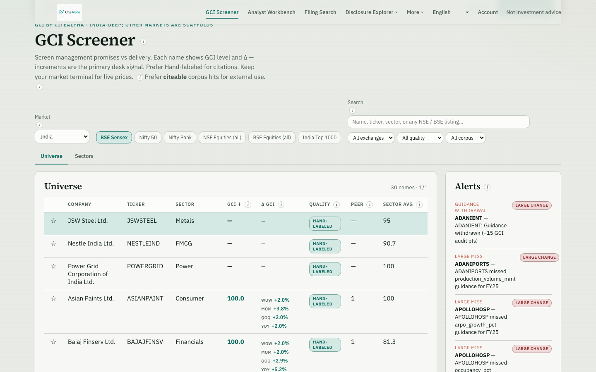

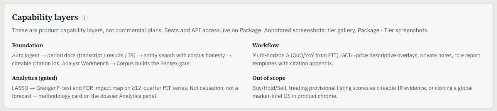

---

## Tier 1 — Foundation

If this layer is weak, nothing downstream is trustworthy.

```
automatic ingest → structure preserved → entity searchable → every GCI cell citable
```

### #1 — Entity search across covered exchanges

Search returns covered NSE/BSE entities with GCI when present, plus **doc / citeable facets** (exchange, quality, corpus), not score-only shells.

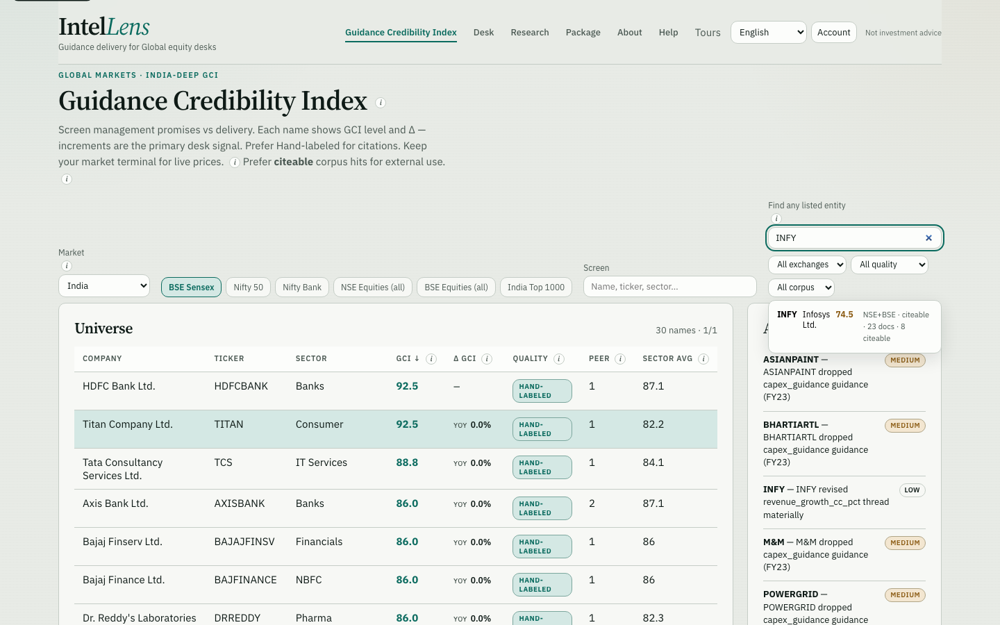

| What you see | Status |
|---|---|
| Typeahead across India universe | Live |
| Facets: exchange · quality · corpus | Live |
| Result row shows docs + citeable counts when known | Live on deep names |

---

### #4 / #5 — Real document ingestion (automatic)

Primary path is **scheduled live IR refresh** → pending docs → extract queue → Accept before GCI. Paste transcript is the **exception** path.

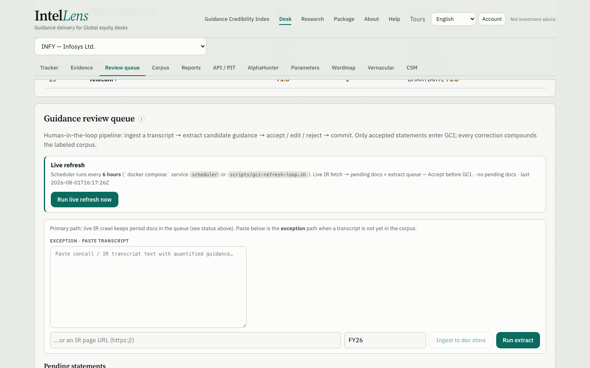

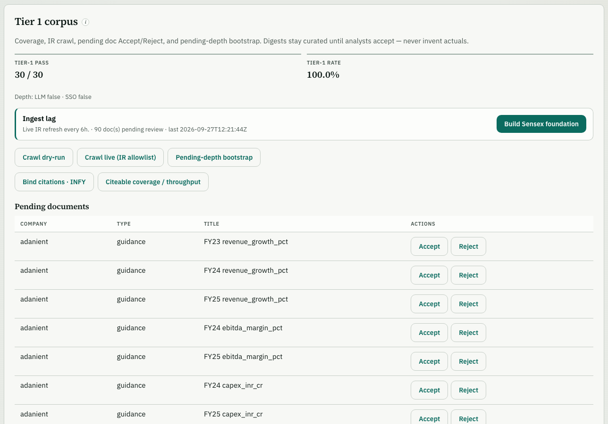

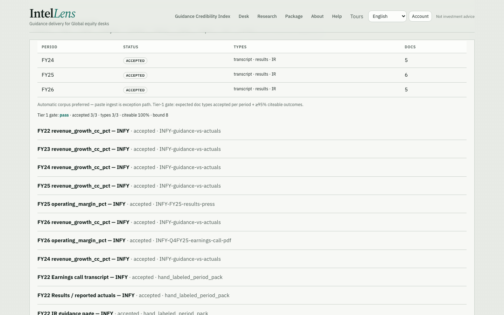

| What you see | Status |
|---|---|
| Live IR refresh every 6h + “Run live refresh now” | Live |
| Period matrix: transcript · results · IR · ACCEPT status | Live (Sensex HL) |
| Tier 1 gate (≥95% citeable + expected types) | Live gating copy |
| Paste ingest | Exception only (still present) |

---

### #6 — Citability (every output traceable to source)

Each score-contributing outcome binds to `citation_id`, source doc, quote span, and Open source. Reports refuse provisional rows.

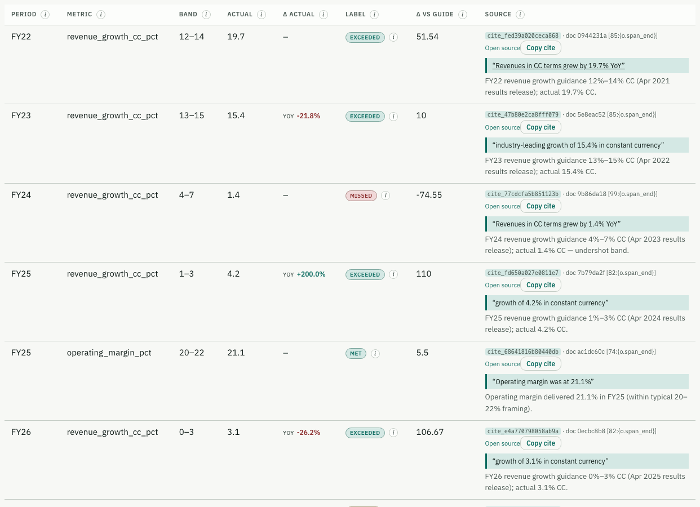

| What you see | Status |
|---|---|
| `cite_*` id + Open source + quote span | Live on hand_labeled |
| Accept / Edit / Reject HITL | Live |
| Reports: citeable outcomes only + appendix | Live |

---

## Tier 2 — Workflow enrichment

Buildable only after Tier 1 is honest.

### #2 — Multi-horizon deltas (WoW / MoM / QoQ / YoY)

Deltas are shown where PIT / period series exist. Missing horizons should show “—” (not invented zeros). INFY demo surface currently emphasizes **QoQ / YoY**.

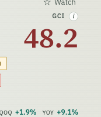

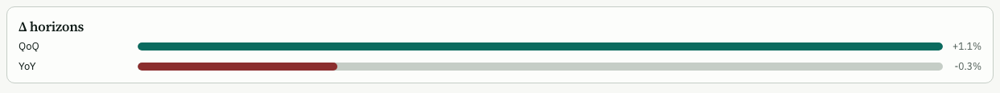

---

### #3 — Delta visualization in charts

Historical GCI trend + period YoY deltas on the dossier Trend panel. Charts are historical only — no forecast cones.

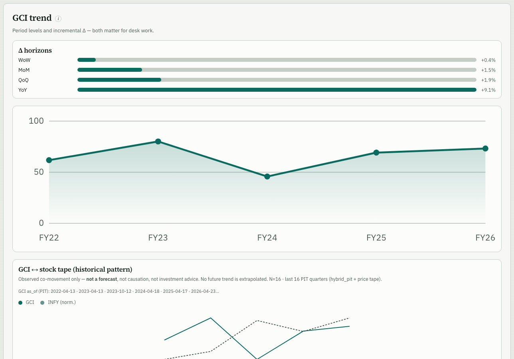

---

### #7 — GCI vs stock-price correlation graphics

**Descriptive pattern only.** Dual series + disclosed N / window. Not a forecast, not causation, not a trading signal.

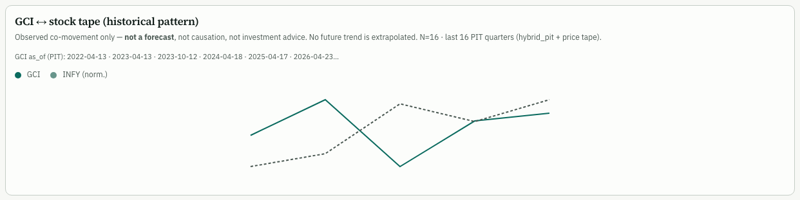

| Locked product rules | |
|---|---|
| Show observed co-movement + N | Yes |
| Extrapolate / “predicted GCI” | No |
| SEBI / factual disclaimer in-panel | Yes |

---

### #10 — Private analyst notes (user-restricted)

Notes are scoped to API key / session — not org-shared by default.

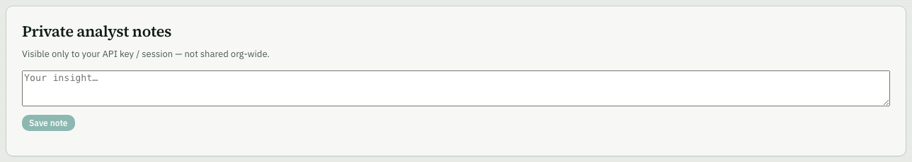

---

### #11 — Role / function-specific report templates

Templates (e.g. Research analyst — Delivery vs guidance) emit Markdown with **citeable outcomes only** plus a citation appendix.

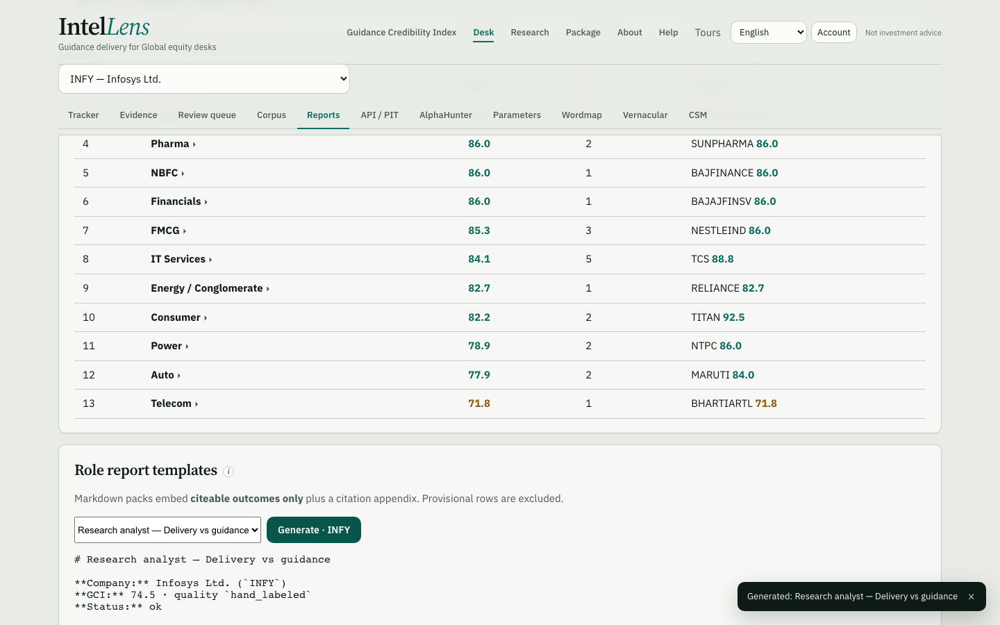

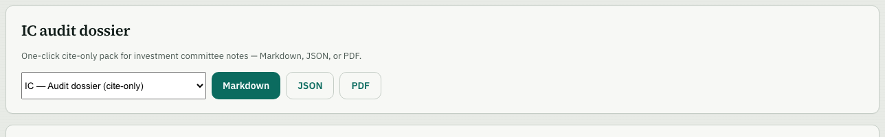

---

## Tier 3 — Frontier research

High value, high methodological risk. UI is **EXPERIMENTAL**. Default engine: **LASSO → Granger F-test** on PIT warehouse (≥12 quarters). VAR held until ≥24. Proxy Pearson/lag corr may appear as support — still descriptive.

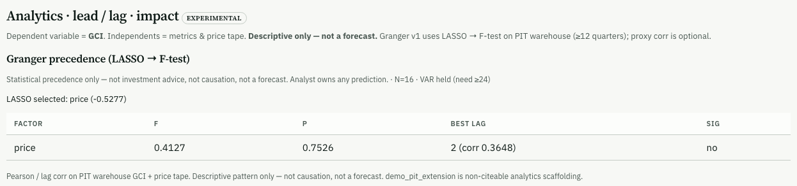

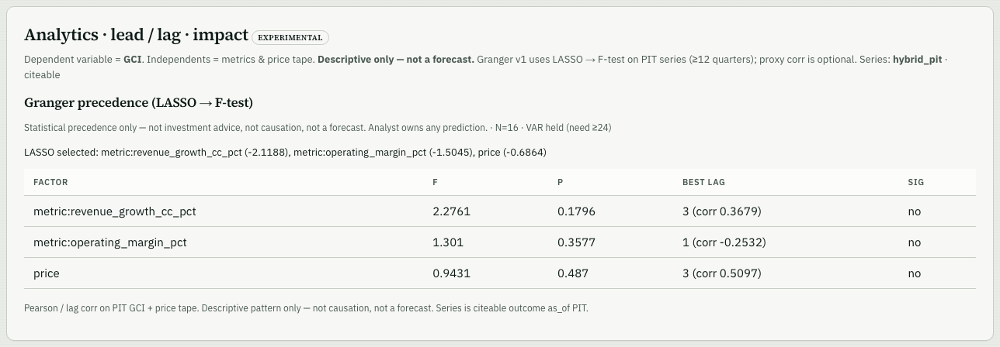

On INFY in this capture: LASSO kept `price`; Granger **not significant** (p ≈ 0.75); best lag 2 shown as descriptive CCF aid; impact edges only draw when FDR-passed Granger links exist.

---

### Methodology options (#8 lead/lag · #9 impact map)

| # | Method | Role for CiteAlpha | Ship stance |
|---|---|---|---|
| **1** | **Cross-Correlation Function (CCF)** | Correlation of two series at different lags (e.g. GCI at t−1 vs price at t). Cheap, interpretable. Weakness: correlation ≠ causation; autocorrelation can invent fake lag peaks. | **Shipped as aid** — “best lag (corr …)” under Granger rows. Not the causal claim. |
| **2** | **Granger causality** | Does X’s past improve Y’s forecast beyond Y’s own past? Standard, explainable to institutional analysts. Weakness: predictive precedence ≠ true causation; needs stationarity / often differencing on India earnings series. | **Tier 3 v1 — shipped** (LASSO → F-test, N gate, experimental badge). |
| **3** | **VAR / VECM** | Joint dynamics across GCI, metrics, tape, etc. Stronger multi-factor lead/lag for impact maps. Weakness: needs longer aligned series; hard to read with too many variables. | **Held** until ≥24 quarters per entity (`VAR held (need ≥24)` in UI). |
| **4** | **LASSO / Elastic Net** | Shrink many candidate independents toward zero — variable selection before Granger/VAR. Not a causation method alone. | **Shipped** as the front step of Granger v1. |
| **5** | **Transfer entropy** | Model-free directional information flow; can catch nonlinear links Granger misses. Weakness: opaque to non-quants; data-hungry. | **Out of scope near-term** (overkill / distrust risk). |
| **6** | **Causal graphical models (e.g. PC algorithm)** | Infer a DAG of impact factors — closest to a full “impact network.” Weakness: heavy assumptions, brittle edges, experts must audit every arrow. | **Out of scope near-term** (high distrust if a wrong arrow ships). |

**Recommended path (locked in plan):** stationarity gates → **LASSO → Granger** → optional CCF chart → VAR when N allows → never present TE/DAG as customer-facing “truth” in v1.

---

## Quick map: ask → screenshot

| Ask | Tier | Primary screenshot(s) |
|---|---|---|
| #1 Entity search | 1 | `01-entity-search.png` |
| #2 Multi-horizon deltas | 2 | `02-*.png`, `02b-horizon-bars.png` |
| #3 Delta charts | 2 | `03-delta-charts-trend.png` |
| #4/#5 Auto ingest | 1 | `05-auto-ingest-crawl.png`, `05b-corpus-foundation.png`, `04-period-documents.png` |
| #6 Citability | 1 | `06-citability-evidence.png` |
| #7 GCI↔price | 2 | `07-gci-vs-price.png` |
| #8 Lead/lag | 3 | `08-lead-lag-granger.png` |
| #9 Impact mapping | 3 | `09-impact-map.png` (+ Granger edges when sig) |
| #10 Private notes | 2 | `10-private-notes.png` |
| #11 Report templates | 2 | `11-report-templates-desk.png`, `11-report-templates-dossier.png` |

---

## Compliance note

Factual GCI research only — **not investment advice**. No Buy / Hold / Sell. Tier 3 graphics are statistical precedence / correlation, not proven cause.
