# CiteAlpha — Response to the Site Revision Proposal

**Prepared for:** the reviewer of *"CiteAlpha — Site Revision Proposal" (as of 25 Sep 2026)*
**Status as of:** 27 Sep 2026 · all changes below are live on [citealpha.com](https://citealpha.com)
**Screenshots:** captured from production on 27 Sep 2026 at 1280 px desktop width. The three Analyst Workbench captures (Figures 11–13) come from a local build because they need a pilot login; that build is the same code that is live.

---

## 1. Summary

We accepted the proposal's central call. The homepage is now a **category-definition + proof page** whose job is to earn a "show me more" from a Head of Research, not to explain five products.

This revision (round 2) closes the items the first response left open:
- the **naming table**
- the **three user journeys**, including the Workbench first run the proposal called a P0 gap
- **surfaces labelled by function and stage**
- the **footer relabel**
- a worked example that shows **guidance quote + call date, the actual's filing link, and the citation trail as a card with coloured chips**

Every P0, P1 and P2 item in the proposal is now done. Section 6 lists the few things we still chose not to do, with reasons.

Three things went beyond the proposal:
1. **Building the citation trail corrected our own data.** When we linked each Infosys row to its primary filing, two values turned out to differ from the filings: the FY22 guidance band (12–14%, not 10–12%) and the FY26 report date. Both are fixed and logged (section 4.2).
2. **We found and fixed a score mismatch between pages.** For 22 companies, the screener list and the Public Snapshot showed a different GCI from the company dossier (Infosys: 73.2 vs 48.2). Every page now shows the same, audited number, and a test enforces it (section 5.2).
3. **The copy rules are enforced automatically.** A test fails if recommendation language, the retired claims, or a stale static worked example come back into public copy.

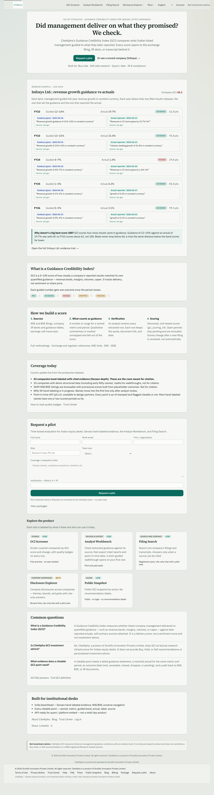

*Figure 0. The revised homepage, top to bottom (full-page capture).*

---

## 2. Naming: the proposal's table, and what is live

We adopted the proposal's suggested names. These are **display names**: URLs are unchanged (`/tracker`, `/desk`, `/research`, `/sights`, `/rankings`), so existing links and bookmarks keep working.

| Proposal: current name | Proposal: suggested | Live now | Where it changed |
|---|---|---|---|
| CiteAlpha (brand) | Lead marketing with "GCI by CiteAlpha" | **"GCI by CiteAlpha"** in the hero kicker, the browser/page titles, link-preview (Open Graph / X) titles, the static HTML and `llms.txt` | The logo and brand assets are unchanged |
| Tracker | "GCI Screener" / "Scorecard" | **GCI Screener** | Nav, page H1, homepage card, glossary, guided tour, 404 page, SEO title |
| Desk | "Analyst Workbench" / "Research Desk" | **Analyst Workbench** | Nav, page H1, homepage card, glossary, tour, SEO title and static page |
| Research | "Filing Search" | **Filing Search** | Nav, page H1, homepage card, glossary, tour, SEO title |
| Sights | Fold into Filing Search, or "Disclosure Explorer"; drop "OS" | **Disclosure Explorer** (kept separate; no "OS" anywhere) | Nav menu, section H1, homepage card, glossary, tour, breadcrumbs, SEO titles |
| Rankings | Merge as a toggle, or "Public Snapshot" | **Public Snapshot** (kept as its own page) | Nav, footer, page H1, homepage card, SEO title |

Two deliberate choices:
- **Disclosure Explorer and Public Snapshot were renamed, not merged.** The two jobs are separate: *one company's filings* (Filing Search) vs *across companies* (Disclosure Explorer), and *public, no login* (Public Snapshot) vs *full screener* (GCI Screener). The names and descriptors now make that split explicit. Merging can follow if usage shows people treat them as one tool.
- **"Desk" survives only as a plan name** (Pilot / Desk / Enterprise on the Packages page), where it describes a seat type, not a screen.

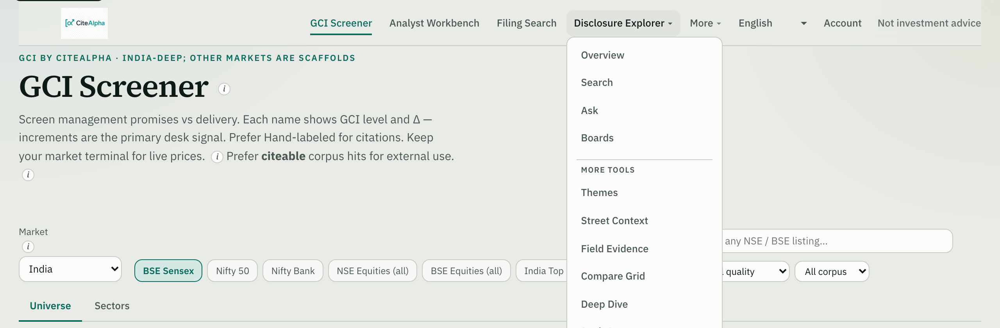

*Figure 1. Navigation and the GCI Screener page with the new names; the Disclosure Explorer menu is open (live).*

---

## 3. The three journeys

The proposal described three visitors and what each should see. Here is what each one gets now.

| Visitor | Proposal's journey | Live journey | Status |
|---|---|---|---|
| **Cold visitor** (first touch from search, LinkedIn or a forward) | Homepage → worked example → methodology → **Request a pilot** | Hero with **one** primary button, "Request a pilot", which scrolls to the pilot form on the same page. Next comes the cited worked example (section 4.2), then the definition, the methodology strip and coverage, and then the pilot form. "Or see a scored company (Infosys)" is a text link, not a competing button. | **Done** |
| **Warm evaluator** (pilot seat, first login) | Straight into Desk/Workbench with a **guided first run** (a P0 gap if missing) | On the first visit to the Analyst Workbench, an 8-step walkthrough **opens automatically** in plain language: what the Workbench is for, the sections, how new filings arrive, and a **demo sample to practise on**. Then coverage, cited reports and point-in-time export. Demo items carry the badge "Demo sample — practice data, not a real filing". It runs once and can be replayed from Help. | **Done** (was the P0 gap) |
| **Public visitor** (no account) | Rankings / Public Snapshot only, **no login, no recommendation chrome** | **Public Snapshot** opens without login. It shows the citeable-only GCI table and its methodology line, and no Buy/Hold/Sell, target or rating language. An automated browser test checks both conditions. | **Done**, and fixed a data bug found on the way (section 5.2) |

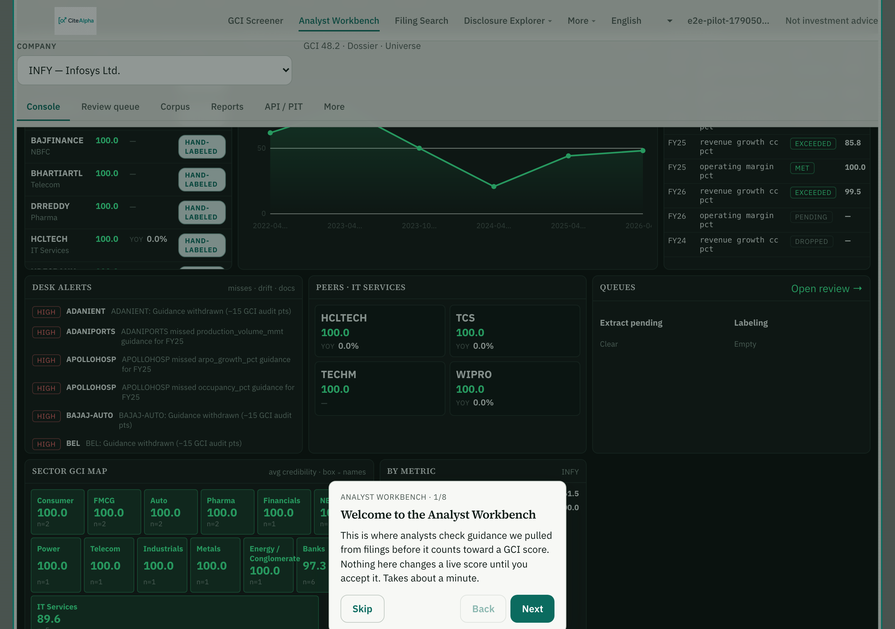

*Figure 2. Warm evaluator: the walkthrough opens by itself on the first Workbench visit (step 1 of 8).*

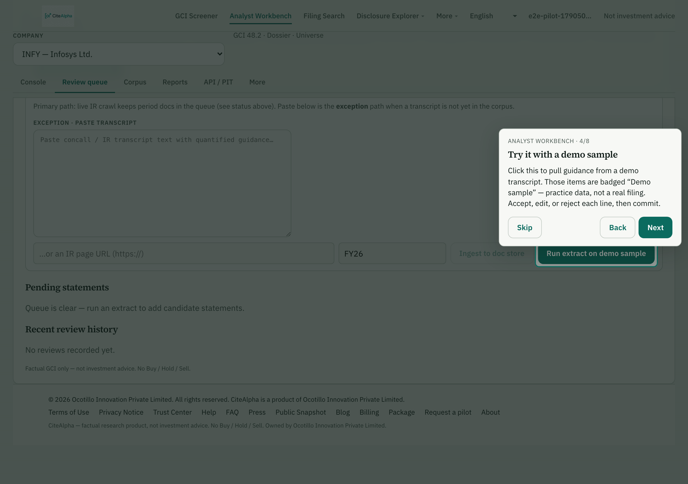

*Figure 3. Step 4 points at the demo extract and explains that demo items are practice data, not a real filing.*

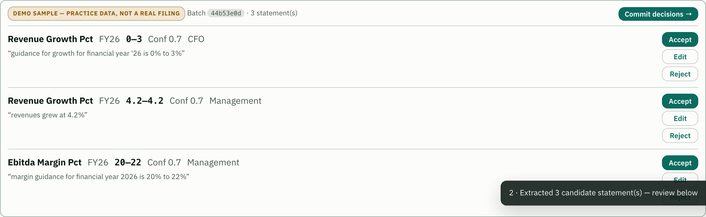

*Figure 4. Demo items in the review queue are badged so no one mistakes them for real filings. The button now reads "Run extract on demo sample" when no text is pasted.*

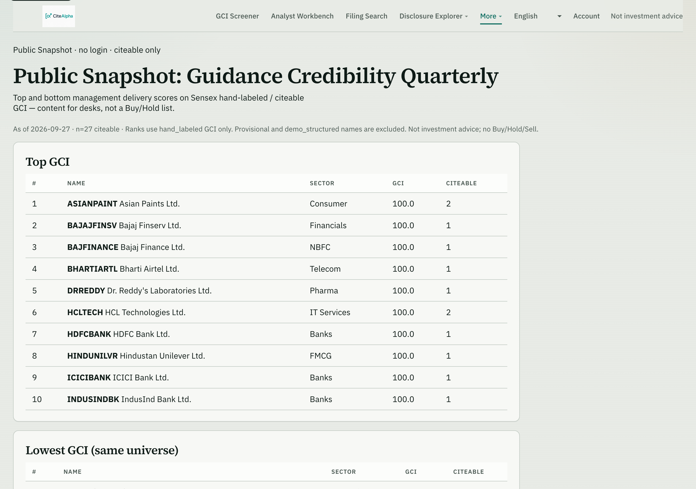

*Figure 5. Public visitor: Public Snapshot, no login, no recommendation chrome; each row shows how many citeable rows back it (live).*

---

## 4. What changed, section by section

### 4.1 Hero: a claim, "GCI by CiteAlpha", one primary action

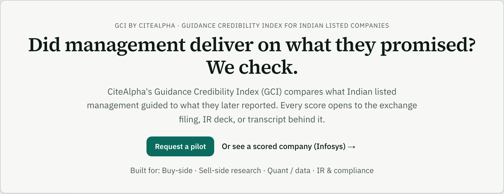

*Figure 6. Hero section (live).*

- **Kicker:** "GCI by CiteAlpha · Guidance Credibility Index for Indian listed companies".
- **H1** is the proposal's claim: "Did management deliver on what they promised? We check."
- **One primary CTA: "Request a pilot"**, which scrolls to the pilot form on the same page.
  - The worked-example link is now a text link, "Or see a scored company (Infosys) →".
  - In round 1 we had made the example the primary button; we reversed that to match the proposal's single-CTA rule.
- **Persona routing line** unchanged: Buy-side · Sell-side research · Quant / data · IR & compliance.

### 4.2 Worked example: quote, date, both filings, citation trail

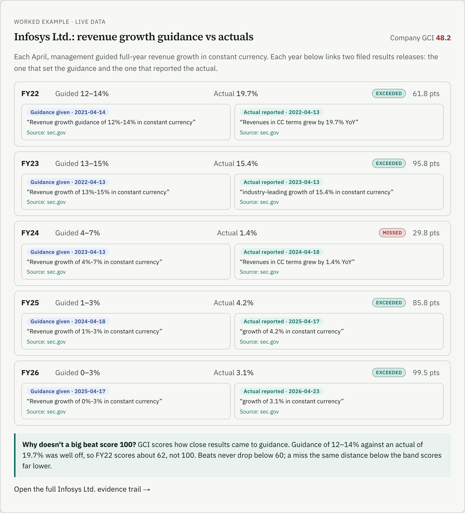

*Figure 7. Worked example (live). Each year cites two SEC-filed Infosys results releases: the one that set the guidance and the one that reported the actual.*

The proposal's mock-up asked for a guidance quote plus call date, the actual's filing link, and a citation trail rendered as a card with coloured chips. Each year's card now shows:

| Element | What is on the card |
|---|---|
| Outcome | Guided band, reported actual, outcome chip (exceeded / missed) and the points that row contributed |
| **Guidance given** (blue chip) | Date the guidance was issued, the exact sentence in quotes, and a link to the filing |
| **Actual reported** (green chip) | Date the actual was reported, the exact sentence in quotes, and a link to the filing |

For example, FY22 reads *Guidance given · 2021-04-14 — "Revenue growth guidance of 12%-14% in constant currency"* and *Actual reported · 2022-04-13 — "Revenues in CC terms grew by 19.7% YoY"*.

**Sources.** All ten links point to Infosys's Form 6-K Exhibit 99.1 results releases on sec.gov, the filed primary documents. We downloaded every filing and checked that each quoted sentence and each date appears in it word for word; all 20 checks pass. We moved off Infosys's own "guidance vs actuals" summary page because it blocks automated checks, and because it disagreed with the filings (next point).

**Data corrections found while building the trail.** We are telling you rather than quietly fixing them:

| Row | Before | After (per filing) | Effect |
|---|---|---|---|
| FY22 guided band | 10–12% (from the IR summary table) | **12–14%** (April 2021 results release) | Still "exceeded"; FY22 points 60.4 → 61.8; Infosys GCI 48.1 → 48.2 |
| FY26 report date | 17 Apr 2026 | **23 Apr 2026** | None on the score |

No outcome label changed. Both corrections are logged in the methodology changelog (`docs/kb/03-scoring.md`).

**Behind the card.** Every outcome can now carry a separate guidance source (`guidance_source_url`, `guidance_quote`, `guidance_as_of`) alongside the actual's source, and the dossier API returns both. The crawler-visible static homepage carries the same quotes and links. A test pins it to the live data so the two can't drift apart.

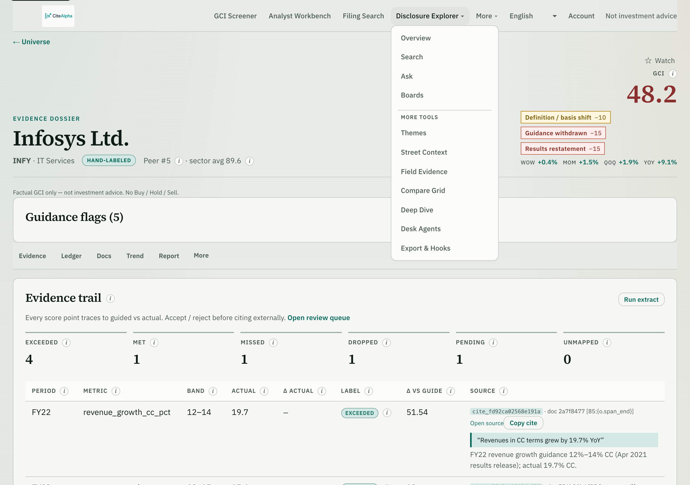

*Figure 8. The dossier the worked example links to (live).*

### 4.3 Definition and methodology (unchanged from round 1)

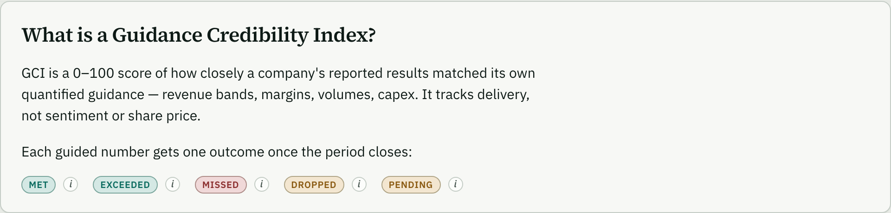

*Figure 9. Two-sentence definition; outcome labels as chips with ⓘ tooltips.*

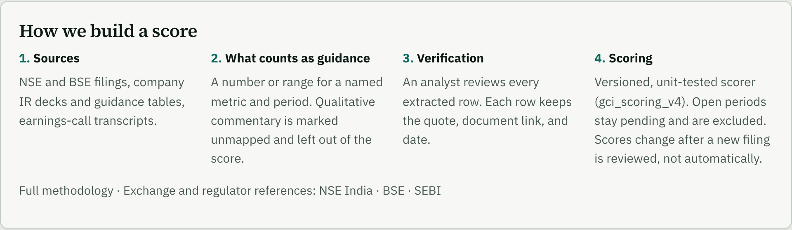

*Figure 10. "How we build a score": sources, what counts as guidance, verification, and scoring (with the live scorer version).*

### 4.4 Coverage: precise, with the roadmap stated as process

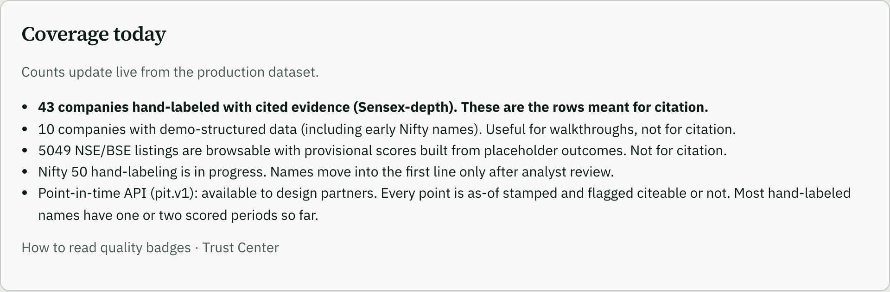

*Figure 11. Coverage panel (live counts from production).*

- **43 companies hand-labeled with cited evidence (Sensex depth).** These are the only rows meant for citation.
- **10 demo-structured companies** (including early Nifty names): for walkthroughs, not citation.
- **5,049 NSE/BSE listings** browsable with provisional scores, labelled "Not for citation".
- **Roadmap:** Nifty 50 hand-labeling is in progress; names move into the first line only after analyst review. We deliberately publish no target quarter (section 6).
- **Point-in-time API (pit.v1):** available to design partners. Every point is as-of stamped and flagged citeable or not, and the panel admits most names have one or two scored periods so far.

### 4.5 Surfaces: labelled by function and stage

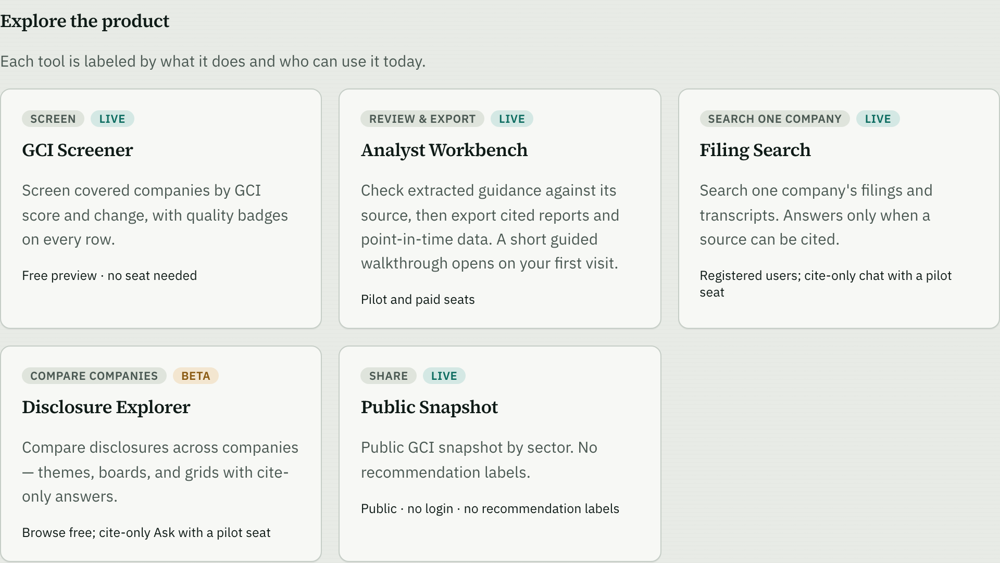

*Figure 12. Product surfaces with function, stage and access labels (live).*

Each card now answers three questions, as the proposal asked: *what it does*, *how mature it is*, and *who can use it today*:

| Surface | Function | Stage | Who can use it |
|---|---|---|---|
| GCI Screener | Screen | Live | Free preview, no seat needed |
| Analyst Workbench | Review & export | Live | Pilot and paid seats (with first-run walkthrough) |
| Filing Search | Search one company | Live | Registered users; cite-only chat with a pilot seat |
| Disclosure Explorer | Compare companies | **Beta** | Browse free; cite-only Ask with a pilot seat |
| Public Snapshot | Share | Live | Public, no login, no recommendation labels |

The access lines come straight from the product's entitlement rules, not from marketing copy. The Analyst Workbench is back on the homepage because the warm-evaluator journey now starts there.

### 4.6 Footer

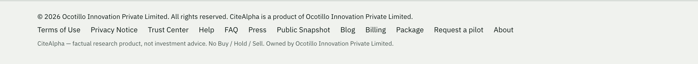

*Figure 13. Site footer (live).*

- **FAQ, Package and Request a pilot** are all in the footer, alongside Public Snapshot and the legal links. On the homepage, "View packages" under the pilot form is now a text link, so the pilot form has no competing button.
- **"GCI Rankings" is relabelled "Public Snapshot".**
- **The bare `/api/meta` link stays removed** from every public page. Coverage counts remain available to integrators as "Coverage counts (JSON)" in `llms.txt`.

### 4.7 Disclaimer, "OS" language, recommendation chrome (round 1, still enforced)

- "Not investment advice" sits in the header badge, the footer and a footnote under the pilot form, not inside trust-building copy.
- "OS" and platform-scale language are gone everywhere.
- The copy-hygiene test (`backend/tests/test_public_copy_hygiene.py`) scans public copy and blocks:
  - recommendation phrasing
  - the retired claims
  - a static worked example that no longer matches the live Infosys data, now including both quotes and both filing links

  The copy it scans: UI strings, page metadata, glossary, tours, blog, static HTML and `llms.txt`.

---

## 5. Score changes: the methodology change and a consistency fix

### 5.1 Scorer v4 (round 1)

Under the old scorer (v3), a large beat decayed toward zero like a large miss (Infosys FY22 scored about 1 point). v4 keeps that decay for beats but floors it at 60: `60 + 40·exp(−α·δ^β)`. In-band results and misses are unchanged, and a beat always outscores a miss of the same distance.

| Infosys row | Guided | Actual | Outcome | v3 points | **v4 points (live)** |
|---|---|---|---|---|---|
| FY22 | 12–14% | 19.7% | exceeded | ≈1 | **61.8** |
| FY23 | 13–15% | 15.4% | exceeded | 89.5 | **95.8** |
| FY24 | 4–7% | 1.4% | missed | 29.8 | **29.8** (unchanged) |
| FY25 | 1–3% | 4.2% | exceeded | 64.4 | **85.8** |
| FY26 | 0–3% | 3.1% | exceeded | 98.8 | **99.5** |

Infosys's company GCI is **48.2**, after audit deductions for withdrawn or reset guidance.

### 5.2 Every page now shows the same score

While checking the Public Snapshot for the public journey, we found two bugs:

1. **Different scores on different pages.** For 22 companies with audit flags (for example a definition shift or withdrawn guidance), the screener list, the Public Snapshot, entity search and the listing cache showed the score *before* audit deductions. The dossier showed it *after*. Examples:
   - Infosys 73.2 vs 48.2
   - Coal India 4.7 vs 0.0
   - HDFC Life, ONGC, Hindalco and Trent about 10 points higher in lists than in their dossiers

   All surfaces now use the audited number. A new test (`tests/test_score_consistency.py`) fails if any list, snapshot or point-in-time series disagrees with the dossier.
2. **"Citeable rows" always read 0 on the Public Snapshot.** It was counting the wrong objects. It now matches the dossier (Infosys 8).

Both fixes are logged in the methodology changelog with the before and after numbers.

---

## 6. Existing vs revised: impact on users

The proposal closed with this table. Here is how each row landed:

| Area | Existing (before review) | Revised (live) | Impact on users |
|---|---|---|---|
| First impression | Descriptive H1, five equal product links | Claim H1, "GCI by CiteAlpha", one primary CTA | A Head of Research sees the question GCI answers, and one next step |
| Proof | No example | Real Infosys example: quotes, dates and two filed sources per year | A sceptic can verify a row in two clicks, from guidance to actual |
| Naming | Tracker / Desk / Research / Sights / Rankings | GCI Screener / Analyst Workbench / Filing Search / Disclosure Explorer / Public Snapshot | Each name says what the tool does; no "OS" |
| Surfaces | Equal cards, no maturity or access signal | Function, stage (Live/Beta) and access on every card | Visitors know what they can open today, and what needs a seat |
| Cold journey | Five competing links | Hero → proof → method → coverage → pilot form | One path to a pilot request |
| Warm journey | Desk opened on a dense console with no guidance | Automatic first-run walkthrough and badged demo sample | A new pilot user learns the Workbench in about a minute without a call |
| Public journey | "GCI Rankings", citeable column always 0, list score ≠ dossier | "Public Snapshot": no login, real citeable counts, same score as the dossier | Public numbers can be quoted and will match the evidence trail |
| Coverage | "Sensex → Nifty" read as more than we had | Four precise tiers, "not for citation" where it applies, roadmap as process | No over-claim for a quant or compliance reviewer to catch |
| Footer | Bare `API meta` link beside commercial links | FAQ · Package · Request a pilot; machine endpoint only in `llms.txt` | No developer artefacts in buyer-facing chrome |
| Compliance | Rules in reviewers' heads | Enforced by automated tests (copy hygiene, static example, score consistency) | Regressions fail the test suite before they reach the site |

---

## 7. What we still chose not to do, and why

| Item | Decision | Reason |
|---|---|---|
| Merge Disclosure Explorer into Filing Search; merge Public Snapshot into the Screener as a toggle | Renamed, not merged | The jobs differ (one company vs across companies; public vs full). Merge once usage shows people treat them as one tool |
| Target quarter for Nifty expansion | Not published | We won't publish a date we can't commit to; the panel says "in progress" |
| Filing-to-score latency as a number | Stated as a process | No measured SLA yet; a number would be an unbacked claim |
| Non-English versions of the new copy | Pending translation | The 16 other languages show the corrected English text for renamed or rewritten strings until translated |

---

## 8. How this was verified

- **Automated tests:**
  - backend: 319 passed. Includes new checks:
    - the Infosys citation trail (two SEC sources per row, guidance date before actual date, FY22 = 12–14%)
    - score consistency across list, snapshot and PIT vs dossier
    - Public Snapshot citeable counts
  - frontend: 12 of 12 unit tests passed
  - end-to-end: 129 of 129 browser tests passed. New ones cover:
    - the worked-example trail
    - the single hero CTA scrolling to the pilot form
    - function and stage labels on all five surfaces
    - the footer pilot link
    - Public Snapshot with no login and no recommendation language
    - the Workbench walkthrough opening once on first visit and not again after being skipped
- **Known failing checks (unchanged from round 1):** four source-verification tests that re-download company PDFs (IndusInd, Axis Bank, Tech Mahindra, Sun Pharma). Those URLs have moved or now block automated downloads. The rows are queued for analyst re-verification; no values were changed or guessed.
- **Filing verification:** all ten Infosys SEC links were downloaded. Every quoted sentence and every date was found verbatim (20 of 20).
- **Live checks on citealpha.com after deploy:**
  - the static homepage has the brand kicker, the single pilot CTA, the new names and the SEC-cited Infosys lines, and no "10–12%"
  - the API returns both sources on every Infosys row
  - screener list = dossier = Public Snapshot for all audit-flagged names checked (Infosys 48.2 on all three)
  - every Public Snapshot row has a non-zero citeable count
  - all key routes return 200

---

## 9. Where to look

- **Live homepage:** [citealpha.com](https://citealpha.com)
- **Worked-example dossier:** [citealpha.com/companies/infy](https://citealpha.com/companies/infy)
- **Public Snapshot:** [citealpha.com/rankings](https://citealpha.com/rankings)
- **Methodology:** [citealpha.com/about#how](https://citealpha.com/about#how)
- **Trust Center:** [citealpha.com/trust](https://citealpha.com/trust)
- **Code (for technical reviewers):**
  - round 1: `169917a` (homepage revision) and `36abcb3` (scorer v4)
  - round 2: `58bd6fe` (citation trail, renames, single CTA, Workbench first run) and `9a1d7a6` (audited score on every surface, Public Snapshot citeable counts)

*CiteAlpha is a factual research product of Ocotillo Innovation Private Limited. Not investment advice. No Buy / Hold / Sell.*
